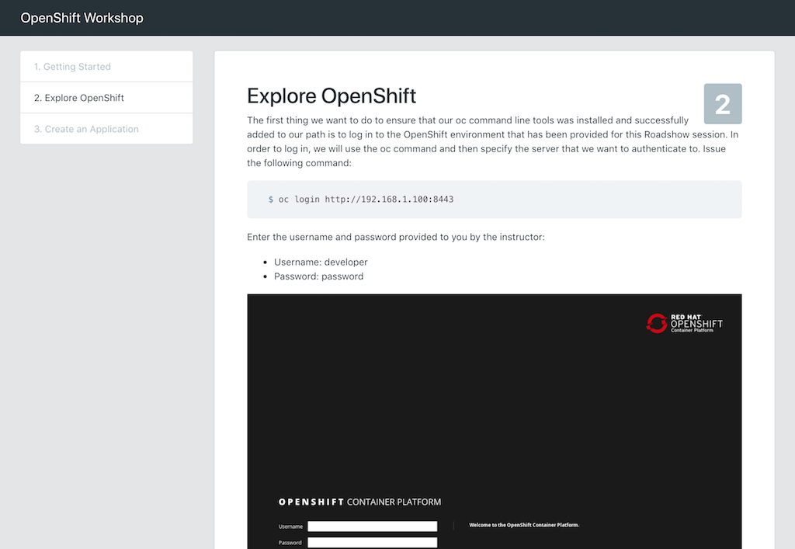

# Workshopper Template

This repository containers a template for building lab and workshop content using [Workshopper](https://github.com/openshift-evangelists/workshopper) which is an engine for building a web-based workshop 
or lab guide. The content of each lab could be written in Markdown or AsciiDoc. For more details on how to 
use Workshopper, consult the docs on its [GitHub Repository](https://github.com/openshift-evangelists/workshopper).



## File Structure

### `_modules.yml`
Lists all labs, their dependencies and where the lab content is hosted (GitHub, web server, etc). Note that this file has to be in the root of the repository.

### `_workshop1.yml`
A yaml file with arbitrary name that specifies which labs should be included in the rendered workshop guide. Note that the lab names should already be listed in `_modules.yml`. It goes without going that you can have multiple of these yaml files to customize your workshop for different purposes.

### `*.md` or `*.adoc`
The actual lab instructions depending on which markup language you have chosen (specified in `_modules.yml`). Node that the name of the file should be the exact same name as the key in `_modules.yml`.

## Deploy On OpenShift

You can deploy Workshopper as a container image anywhere but most conveniently, you can deploy it on OpenShift Online or other OpenShift flavours:

```
$ oc new-app quay.io/osevg/workshopper --name=myworkshop \
      -e WORKSHOPS_URLS="https://raw.githubusercontent.com/siamaksade/workshopper-template/master/_workshop1.yml" \
      -e JAVA_APP=false 
$ oc expose svc/myworkshop
```

The lab content (`.md` and `.adoc` files) will be pulled from the GitHub when users access the workshopper in 
their browser.

Note that the workshop variables can be overriden via specifying environment variables on the container itself e.g. the `JAVA_APP` env var in the above command

## Test Locally with Docker

You can directly run Workshopper as a docker container which is specially helpful when writing the content.
```
$ docker run -p 8080:8080 -v $(pwd):/app-data \
              -e CONTENT_URL_PREFIX="file:///app-data" \
              -e WORKSHOPS_URLS="file:///app-data/_workshop1.yml" \
              quay.io/osevg/workshopper
```

Go to http://localhost:8080 on your browser to see the rendered workshop content. You can modify the lab instructions 
and refresh the page to see the latest changes.# workshopper-sso
